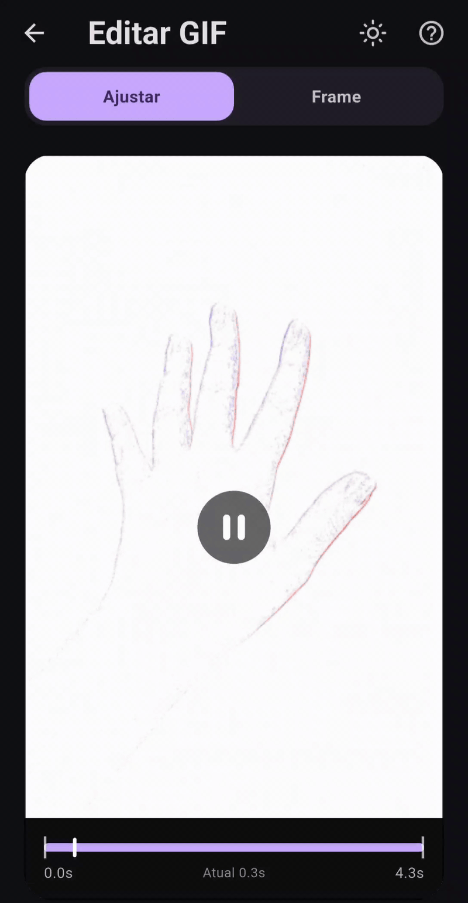

<div align="center">


# Video to GIF

<br>

[](https://github.com/lianeheidemann/video-to-gif/actions/workflows/ci.yml)


**Video-to-GIF converter built in Flutter, with file-size estimation before conversion**

</div>

---

## About

Android app that converts common video formats (MP4, MOV, AVI, MKV, WEBM,
3GP) to GIF, with control over trimming, aspect ratio, speed, resolution and
frame rate — and, above all, **showing how big the file will be before you
spend time converting it**.

> All conversion runs on-device with FFmpeg. The app has no internet
> permission.
>
> **[⬇ Download the APK](https://github.com/lianeheidemann/video-to-gif/releases/latest)**
> — installs straight onto Android, no store needed.

<br>

## Gif

<div align="center">



</div>

## Interface


## The problem it solves

Converting video to GIF is slow, and the output size is unpredictable: the
same settings that produce 800 KB for one video produce 14 MB for another,
because it depends on how much the scene moves. The usual workflow is
convert, see it came out too big, adjust and convert again — several minutes
per attempt.

This app flips that around:

1. **Instant estimate** while you adjust the controls, without converting
   anything. Before any measurement the number comes from a guess based on
   the file's bitrate, and the displayed range is deliberately wide (±40% to
   ±55%).
2. **"Measure" button**, which converts two clips of up to one second each
   with the chosen settings and uses their real size to calibrate the
   calculation — from then on the displayed range narrows to ±15%. The model
   separates the cost of the first frame (a full image) from the cost of the
   following ones (just the rectangle that changed), which is what lets it
   measure 1 second and predict 40 without inflating the number for a static
   scene.
3. **Destination traffic light**: shows whether the GIF fits within
   WhatsApp's, X/Twitter's and Discord's limits. If it doesn't fit, one tap
   adjusts the settings so it does.

> [!WARNING]
> **The estimate is still being refined.** The pre-measurement guess (step 1)
> is the least accurate part of the model — it's based on bitrate alone, which
> is why its range is intentionally shown as wide (±40–55%). Tapping
> **Measure** narrows this to ±15%, but a few content types (e.g. moving
> gradients) can still fall outside that range. See
> [Measured accuracy](docs/en/HOW_THE_ESTIMATE_WORKS.md#measured-accuracy) for
> current numbers and known gaps.

How this works under the hood is documented in
[`docs/en/HOW_THE_ESTIMATE_WORKS.md`](docs/en/HOW_THE_ESTIMATE_WORKS.md).

## Features

- **Video preview** with play/pause and a timeline marking the selected
  clip
- **Duration trim** — drag the selector's handles to choose the clip
- **Crop aspect ratio** — Original, 1:1, 4:5, 9:16, 16:9 and Custom, with
  resizing via the four corner handles directly on the preview and bars to
  reposition the crop
- **Speed** — 0.25x (slow motion) to 2x
- **Resolution** — from 160 px to 800 px wide, only offering options that
  don't upscale the original video
- **Frame rate** — 5, 8, 10, 12, 15, 20 or 24
- **Color quality** — palette of 64, 128 or 256 colors, five dithering
  levels and three palette strategies
- **Looping** — infinite loop or play once
- **Two-pass conversion** (`palettegen` + `paletteuse`), which is what
  separates a good-looking GIF from a "washed out" one
- **Progress with cancellation**
- **Save to gallery and share**, with the final screen showing how far off
  the prediction was from the generated file

## How to run it

Requires Flutter 3.44+ (Dart 3.12+) and the Android SDK (API 36) with NDK
installed.

```bash
git clone https://github.com/lianeheidemann/video-to-gif.git
cd video-to-gif
```
```
flutter pub get
flutter test
```
```
flutter run
```

### Build the release APK

To generate an optimized APK for installation or distribution, run:

```bash
flutter build apk --release
```

The generated file will be available at:

```text
build/app/outputs/flutter-apk/app-release.apk
```

CI pins the Flutter version to **3.47.0** (`FLUTTER_VERSION` in
`.github/workflows/ci.yml`). If `dart format` complains there but passes on
your machine, it's almost always a version mismatch — run it on the same
one.

### Build the APK

To generate a release APK you can install on a device without `flutter run`:

```bash
flutter build apk --release
```

The APK is written to `build/app/outputs/flutter-apk/app-release.apk`. To
build split APKs per ABI instead of a single universal one (smaller
downloads, closer to what the [Release](https://github.com/lianeheidemann/aplicativo-video-to-gif/releases) page ships), add `--split-per-abi`:

```bash
flutter build apk --release --split-per-abi
```

## Structure

```
lib/
├── main.dart                       # entry point
├── licenses.dart                   # FFmpeg license notice (LGPL)
├── theme.dart                      # Material 3 theme and verdict colors
├── models/
│   ├── video_info.dart             # metadata read via FFprobe
│   ├── conversion_settings.dart    # everything the user controls
│   └── size_estimate.dart          # estimate result and classification
├── services/
│   ├── size_estimator.dart         # the size-prediction model (pure Dart)
│   ├── ffmpeg_service.dart         # reading, measuring and converting
│   └── output_service.dart         # gallery and sharing
└── ui/
    ├── home_page.dart              # video selection
    ├── editor_page.dart            # controls + preview with cropping
    ├── converting_page.dart        # progress and cancellation
    ├── result_page.dart            # finished GIF, save and share
    └── widgets/
        ├── labeled_section.dart    # expandable card and option chips
        └── size_panel.dart         # size and compatibility panel

test/
├── size_estimator_test.dart        # 30 tests for the estimation model
├── size_estimator_medicoes_test.dart  # 7 tests against real measurements
└── size_panel_test.dart            # 10 tests for the size panel

tool/
├── gerar_icones.py                 # generates the app icon and adaptive icon
└── medir_precisao.py               # measures the model's real error against FFmpeg

.github/workflows/
├── ci.yml                          # formatting, analysis, tests and debug APK
└── release.yml                     # publishes the APKs to a Release
```

`size_estimator.dart` is pure Dart, with no dependency on Flutter or
FFmpeg — which is why it can be fully tested without an emulator.

## Quality

There are **47 automated tests**: 30 covering the estimation model (output
dimensions, frame count, monotonicity, calibration, automatic adjustment to
a target and classification), 10 covering the size panel, and 7 comparing
the prediction against **files FFmpeg actually generated**.

The last group deserves a special mention: `tool/medir_precisao.py`
produces five synthetic videos ranging from a static title card to
incompressible noise, converts each one and records the sizes; the test
feeds the model those measurements and checks the error. Once calibrated,
the prediction lands within **±1% for three of the five cases and −7% for
the fourth**. The fifth is a 39 KB GIF, a scale where missing by 17 KB
already means −44% — for that one the test checks absolute error, not
relative. The full table, including the two cases that still miss and why,
is in
[`docs/en/HOW_THE_ESTIMATE_WORKS.md`](docs/en/HOW_THE_ESTIMATE_WORKS.md).

The workflow in `.github/workflows/ci.yml` runs, on every push, `dart
format`, `flutter analyze`, `flutter test` and a debug APK build — the
latter catches Gradle errors, manifest-merging issues and packaging
problems with FFmpeg's native libraries.

## Download the APK

Every published version becomes a
[Release](https://github.com/lianeheidemann/video-to-gif/releases)
with ready-to-install APKs — start with `arm64-v8a`, which covers
practically every current Android phone. `universal` is larger, but works
on any device.

## Stack

| Layer | Choice | Why |
|---|---|---|
| Interface | Flutter 3.44 (Material 3) | one codebase, with a native Android look |
| Conversion | `ffmpeg_kit_flutter_new_min` (FFmpeg LGPL) | variant without GPL components, allows closed-source distribution |
| File picking | `file_picker` | uses the system picker, no media permission required |
| Preview | `video_player` | shows the clip and crop frame before converting |
| Output | `gal` + `share_plus` | save to gallery and share |

## License

App code: [MIT](LICENSE).
FFmpeg: LGPL-2.1-or-later — attribution in [`NOTICE`](NOTICE), details and
obligations in [`docs/en/LICENSES.md`](docs/en/LICENSES.md).

---

<p align="center">Developed by <strong>Liane Heidemann</strong></p>
