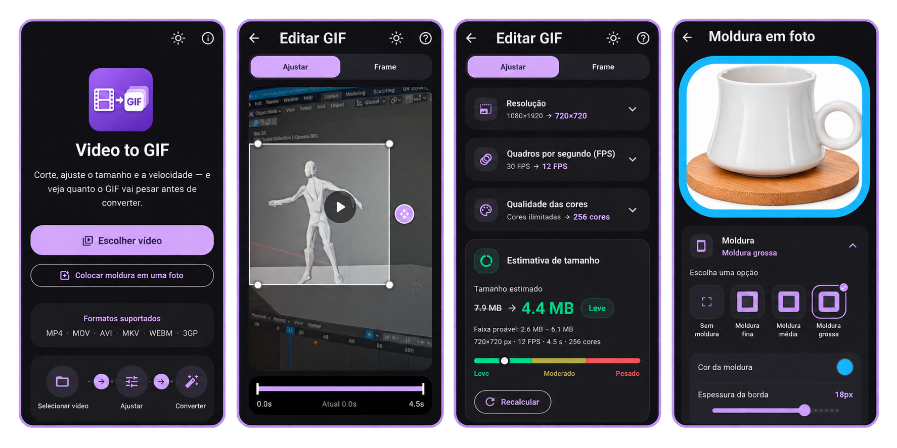

<div align="center">


# Video to GIF


<br>
[](https://github.com/lianeheidemann/video-to-gif/actions/workflows/ci.yml)
[](https://github.com/lianeheidemann/video-to-gif/actions/workflows/release.yml)

**Turn videos and photos into animated GIF or WebP directly on Android — privately and offline.**

</div>

---

## About

Android app built with Flutter with three tools that share the same editor,
the same frame library and the same on-device export pipeline:

| Tool | What it does |
|---|---|
| **Video to GIF/WebP** | Converts MP4, MOV, AVI, MKV, WebM and 3GP to **GIF or animated WebP** — trim, crop, speed, resolution, frame rate, colors and a decorative frame. For GIF it also **estimates the final file size before converting**. |
| **Frame on a photo** | Puts the same procedural or phone-mockup frames around a single photo, with content-fit modes and a transparent or colored background. |
| **Photo collage** | Assembles several photos into one composition — layouts, margins, per-photo borders and backgrounds, stickers, text, crop and color adjustment. If any photo is an animated GIF/WebP, the whole collage can be exported **animated**. |



Choose the format that best fits your destination:

| Format | Best for | Notes |
|---|---|---|
| **GIF** | Broad compatibility and predictable sharing limits | Includes file-size estimation and destination compatibility checks |
| **Animated WebP** | Better color, transparency and smaller files at similar quality | Includes a quality slider; some older apps may not play the animation |

> All conversion runs on-device with FFmpeg. The app has no internet
> permission.
>
> **[⬇ Download the APK](https://github.com/lianeheidemann/video-to-gif/releases/latest)**
> — installs straight onto Android, no store needed.

<br>

## Gif

<div align="left">


</div>

## The problem it solves

Converting video to GIF is slow, and the output size is unpredictable: the
same settings that produce 800 KB for one video produce 14 MB for another,
because it depends on how much the scene moves. The usual workflow is
convert, see it came out too big, adjust and convert again — several minutes
per attempt.

This app flips that around:

1. **Instant estimate** while you adjust the controls, without converting
   anything. Before any measurement the number comes from a guess based on
   the file's bitrate, and the displayed range is deliberately wide (±40% to
   ±55%).
2. **"Measure" button**, which converts two clips of up to one second each
   with the chosen settings and uses their real size to calibrate the
   calculation — from then on the displayed range narrows to ±15%. The model
   separates the cost of the first frame (a full image) from the cost of the
   following ones (just the rectangle that changed), which is what lets it
   measure 1 second and predict 40 without inflating the number for a static
   scene.
3. **Destination traffic light**: shows whether the GIF fits within
   WhatsApp's, X/Twitter's and Discord's limits. If it doesn't fit, one tap
   adjusts the settings so it does.

> [!WARNING]
> **The estimate is still being refined.** The pre-measurement guess (step 1)
> is the least accurate part of the model — it's based on bitrate alone, which
> is why its range is intentionally shown as wide (±40–55%). Tapping
> **Measure** narrows this to ±15%, but a few content types (e.g. moving
> gradients) can still fall outside that range. See
> [Measured accuracy](docs/en/HOW_THE_ESTIMATE_WORKS.md#measured-accuracy) for
> current numbers and known gaps.

How this works under the hood is documented in
[`docs/en/HOW_THE_ESTIMATE_WORKS.md`](docs/en/HOW_THE_ESTIMATE_WORKS.md).

## Features

### Everywhere

The three editors share the same shell: a **bottom tab bar** where each tab
opens its own panel over the preview, small **save / share / convert** icons
in the top-right corner, and **undo / redo**. Continuous controls (sliders,
drags) collapse into a single undo step instead of thirty.

### Video → GIF / WebP

- **Video preview** with play/pause and a timeline marking the selected
  clip
- **Duration trim** — drag the selector's handles to choose the clip
- **Crop aspect ratio** — Original, 1:1, 4:5, 9:16, 16:9 and Custom, with
  resizing via the four corner handles directly on the preview and bars to
  reposition the crop
- **Speed** — 0.25x (slow motion) to 2x
- **Resolution** — from 160 px to 800 px wide, only offering options that
  don't upscale the original video
- **Frame rate** — 5, 8, 10, 12, 15, 20 or 24
- **Output format** — GIF or animated WebP. GIF gets a 256-color palette
  (dithering + palette strategy below) and the size estimate/destination
  traffic light; WebP skips the palette and encodes real full-color +
  transparency directly through `libwebp`, with its own quality slider
  (50–95)
- **Color quality** (GIF) — palette of 64, 128 or 256 colors, five
  dithering levels and three palette strategies
- **Looping** — infinite loop or play once
- **Size** — the estimate, the confidence range and the destination traffic
  light live in their own tab, next to the "Measure" button
- **Two-pass conversion for GIF** (`palettegen` + `paletteuse`), which is
  what separates a good-looking GIF from a "washed out" one; WebP instead
  goes straight through `libwebp` in a single pass, no palette involved
- **Progress with cancellation**
- **Save to gallery and share**, with the final screen showing how far off
  the prediction was from the generated file (GIF) or the final size and
  settings used (WebP)

### Frames (video and single photo)

- **Procedural border** — thin, medium or thick, with custom color and
  corner rounding
- **Image frame** — bundled phone-mockup SVGs, or your own image imported
  with an automatically-detected transparent window
- **Content fit** — auto, fill, fit, or expand with zoom, for when the
  content doesn't match the frame's aspect ratio
- **Background** — transparent (real alpha on WebP and PNG, a single
  reserved color on GIF) or a solid color

### Photo collage

- **Layouts** — row, column, 2x2, 2x3, 3x3 or a free grid where you pick the
  number of rows and columns
- **Aspect ratio and margin** of the composition, with the margin applied
  both between the cells and around the outside
- **Border** — thickness proportional to the cell (so it looks the same at
  any export resolution), color and corner rounding, set for the whole
  montage or per photo
- **Background** — transparent by default, a solid color (swatches, HSV
  wheel or an eyedropper on the preview itself) or an imported image, chosen
  **separately for the montage and for the photos inside the cells**
- **Per photo**, from the cell's `⋯` menu: replace, swap with another cell,
  crop, adjust color, rotate 90°, flip horizontally or vertically, recenter
- **Crop** — free by default, with ready ratios (1:1, 4:5, 5:4, 3:4, 4:3,
  9:16, 16:9, the cell's own) and a custom one you type in. An approved crop
  comes back fitted and upright inside its cell, never stretched
- **Color adjustment** — eight controls as circular buttons with an
  intensity ruler underneath: brightness, exposure, contrast, highlights,
  shadows, saturation, hue and temperature. The same color matrix drives the
  live preview and the export
- **Double tap** on a photo centers it upright inside the cell; a second tap
  expands it to fill the cell, still upright
- **Stickers** — bundled SVGs or your own imported SVG/image, dragged,
  scaled and rotated freely, with their own stacking order
- **Text** — color, size, one of the bundled fonts, and an optional
  background box with its own color and corner rounding
- **Animated export** — when any photo in the montage is an animated
  GIF/WebP, saving and sharing offer **PNG, GIF or WebP**, plus a choice of
  matching the **longest** or the **shortest** animation. Photos that finish
  early hold their last frame instead of disappearing

## How to run it

Requires Flutter 3.44+ (Dart 3.12+) and the Android SDK (API 36) with NDK
installed.

```bash
git clone https://github.com/lianeheidemann/video-to-gif.git
cd video-to-gif
```
```
flutter pub get
flutter test
```
```
flutter run
```

### Build the release APK

To generate a release APK you can install on a device without `flutter run`:

```bash
flutter build apk --release
```

The APK is written to `build/app/outputs/flutter-apk/app-release.apk`. To
build split APKs per ABI instead of a single universal one (smaller
downloads, closer to what the [Release](https://github.com/lianeheidemann/video-to-gif/releases) page ships), add `--split-per-abi`:

```bash
flutter build apk --release --split-per-abi
```

CI pins the Flutter version to **3.47.0** (`FLUTTER_VERSION` in
`.github/workflows/ci.yml`). If `dart format` complains there but passes on
your machine, it's almost always a version mismatch — run it on the same
one.

## Structure

```
lib/
├── main.dart                         # entry point
├── licenses.dart                     # FFmpeg license notice (LGPL)
├── theme.dart                        # Material 3 theme and verdict colors
├── theme_controller.dart             # light/dark mode, persisted
├── models/
│   ├── video_info.dart               # metadata read via FFprobe
│   ├── photo_info.dart               # path and native size of a picked photo
│   ├── conversion_settings.dart      # everything the user controls
│   ├── size_estimate.dart            # estimate result and classification
│   ├── crop_rect.dart                # normalized crop, shared by the crop tools
│   ├── frame_settings.dart           # procedural frame style/geometry
│   ├── image_frame.dart              # image-frame assets and bundled library
│   ├── collage_layout.dart           # cell grid and cell rectangles
│   ├── collage_settings.dart         # the whole montage: cells, style, overlays
│   ├── collage_cell.dart             # per-photo framing, border and color matrix
│   ├── collage_background.dart       # transparent / color / image background
│   ├── collage_color_adjustment.dart # the eight color controls
│   ├── collage_sticker.dart          # sticker placement and source
│   ├── collage_text.dart             # text, font and background box
│   └── collage_export.dart           # PNG/GIF/WebP + longest/shortest duration
├── services/
│   ├── size_estimator.dart           # the size-prediction model (pure Dart)
│   ├── ffmpeg_service.dart           # reading, measuring and converting
│   ├── output_service.dart           # gallery and sharing
│   ├── imported_frame_store.dart     # import/persist user image frames
│   ├── imported_asset_store.dart     # import/persist stickers and backgrounds
│   ├── photo_frame_compositor.dart   # renders the framed single photo
│   ├── collage_compositor.dart       # renders one montage frame off-screen
│   └── collage_animation.dart        # timeline + PNG sequence for animated export
└── ui/
    ├── home_page.dart                # video, single photo or collage
    ├── editor_page.dart              # video controls + preview, tabbed footer
    ├── photo_frame_page.dart         # frame on a single photo
    ├── collage_page.dart             # the collage editor
    ├── photo_crop_page.dart          # free/preset/custom crop for a cell
    ├── converting_page.dart          # progress and cancellation
    ├── result_page.dart              # finished GIF, save and share
    └── widgets/
        ├── labeled_section.dart      # expandable card and option chips
        ├── editor_tabs_footer.dart   # the bottom tab bar shared by the editors
        ├── size_panel.dart           # size and compatibility panel (GIF)
        ├── webp_convert_panel.dart   # convert panel shown for WebP
        ├── cropped_view.dart         # crop preview for the frame tab
        ├── crop_overlay.dart         # draggable crop handles
        ├── frame_painter.dart        # draws procedural/image frame geometry
        ├── collage_painter.dart      # single source of montage drawing
        ├── collage_cell_view.dart    # a cell in the live preview
        ├── collage_overlay_view.dart # stickers and text in the live preview
        ├── color_adjust_controls.dart# circular buttons + intensity ruler
        └── color_picker_sheet.dart   # swatches, HSV wheel and eyedropper

test/                                 # 207 tests, see "Quality" below

tool/
├── gerar_icones.py                   # generates the app icon and adaptive icon
└── medir_precisao.py                 # measures the model's real error against FFmpeg

.github/workflows/
├── ci.yml                            # formatting, analysis, tests and debug APK
└── release.yml                       # publishes the APKs to a Release
```

`size_estimator.dart` is pure Dart, with no dependency on Flutter or
FFmpeg — which is why it can be fully tested without an emulator. The same
applies to `collage_painter.dart`: the live preview and the exported file
call into it, so the two can never drift apart.

## Quality

There are **207 automated tests**:

| Area | Tests | What they cover |
|---|---|---|
| Estimation model | 37 | Output dimensions, frame count, monotonicity, calibration, automatic adjustment to a target, classification — plus 7 comparing the prediction against **files FFmpeg actually generated** |
| Size panel and WebP panel | 13 | The panel, the traffic light and the convert panel shown for WebP |
| Frames and video geometry | 41 | Canvas geometry, output-format defaults, crop preview, crop handles, frame drawing/masking and the frame picker UI |
| WebP export path | 6 | The FFmpeg argument builders for the no-palette/single-pass path, including that they never reintroduce GIF-only tricks like `reserve_transparent` or `-gifflags` |
| Collage | 110 | Cell framing and color matrices, layout geometry, shared cell style, text and its background box, compositing against golden pixels, the color picker sheet, the imported-asset store, the crop screen, the editor itself, the animation timeline (including that a short photo freezes on its last frame) and the GIF/WebP sequence arguments |

The measurement group deserves a special mention: `tool/medir_precisao.py`
produces five synthetic videos ranging from a static title card to
incompressible noise, converts each one and records the sizes; the test
feeds the model those measurements and checks the error. Once calibrated,
the prediction lands within **±1% for three of the five cases and −7% for
the fourth**. The fifth is a 39 KB GIF, a scale where missing by 17 KB
already means −44% — for that one the test checks absolute error, not
relative. The full table, including the two cases that still miss and why,
is in
[`docs/en/HOW_THE_ESTIMATE_WORKS.md`](docs/en/HOW_THE_ESTIMATE_WORKS.md).

The workflow in `.github/workflows/ci.yml` runs, on every push, `dart
format`, `flutter analyze`, `flutter test` and a debug APK build — the
latter catches Gradle errors, manifest-merging issues and packaging
problems with FFmpeg's native libraries.

## Download the APK

Every published version becomes a
[Release](https://github.com/lianeheidemann/video-to-gif/releases)
with ready-to-install APKs — start with `arm64-v8a`, which covers
practically every current Android phone. `universal` is larger, but works
on any device.

## Stack

| Layer | Choice | Why |
|---|---|---|
| Interface | Flutter 3.44 (Material 3) | one codebase, with a native Android look |
| Conversion | `ffmpeg_kit_flutter_new_video` ([FFmpeg](https://github.com/FFmpeg/FFmpeg) LGPL) | variant without GPL components (bundles libwebp for WebP export), allows closed-source distribution |
| File picking | `file_picker` | uses the system picker, no media permission required |
| Preview | `video_player` | shows the clip and crop frame before converting |
| Frame and sticker art | `flutter_svg` | renders the bundled and imported vector art without losing sharpness at any output resolution |
| Collage rendering | `dart:ui` (`PictureRecorder`) | the same painter draws the live preview and the exported frames |
| Output | `gal` + `share_plus` | save to gallery and share |

## License

App code: [MIT](LICENSE).
FFmpeg: LGPL-2.1-or-later — attribution in [`NOTICE`](NOTICE), details and
obligations in [`docs/en/LICENSES.md`](docs/en/LICENSES.md).

---

<p align="center">Developed by <strong>Liane Heidemann</strong></p>
