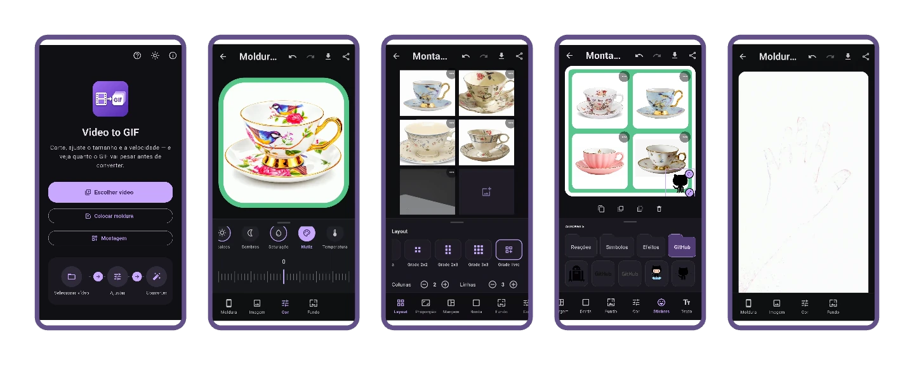

<div align="center">


# Video to GIF


<br>
[](https://github.com/lianeheidemann/video-to-gif/actions/workflows/ci.yml)
[](https://github.com/lianeheidemann/video-to-gif/actions/workflows/release.yml)

**Turn videos and photos into animated GIF or WebP directly on Android — privately and offline.**

</div>

---

## About

Android app built with Flutter with three tools that share the same editor,
the same frame library and the same on-device export pipeline:

| Tool | What it does |
|---|---|
| **Video to GIF/WebP** | Converts MP4, MOV, AVI, MKV, WebM and 3GP to **GIF or animated WebP** — trim, crop, speed, resolution, frame rate, colors and a decorative frame. For GIF it also **estimates the final file size before converting**. |
| **Frame on a photo** | Puts the same procedural or phone-mockup frames around a single photo, with content-fit modes, color adjustment and a transparent or colored background. |
| **Photo collage** | Assembles several photos into one composition — layouts, margins, per-photo borders and backgrounds, stickers (in folders you create), text with imported fonts, crop and color adjustment. If any photo is an animated GIF/WebP, the whole collage can be exported **animated**. |



Choose the format that best fits your destination:

| Format | Best for | Notes |
|---|---|---|
| **GIF** | Broad compatibility and predictable sharing limits | Includes file-size estimation and destination compatibility checks |
| **Animated WebP** | Better color, transparency and smaller files at similar quality | Includes a quality slider; some older apps may not play the animation |

> All conversion runs on-device with FFmpeg. The app has no internet
> permission.
>
> **[⬇ Download the APK](https://github.com/lianeheidemann/video-to-gif/releases/latest)**
> — installs straight onto Android, no store needed.

<br>

## Gif

<div align="left">


</div>

## The problem it solves

Converting video to GIF is slow, and the output size is unpredictable: the
same settings that produce 800 KB for one video produce 14 MB for another,
because it depends on how much the scene moves. The usual workflow is
convert, see it came out too big, adjust and convert again — several minutes
per attempt.

This app estimates the size **while you adjust the controls**, without
converting anything. The **Measure** button converts two clips of up to one
second with the chosen settings and uses their real size to calibrate the
calculation, narrowing the displayed range from ±40–55% to ±15%. A
**destination traffic light** shows whether the GIF fits within WhatsApp's,
X/Twitter's and Discord's limits, and one tap adjusts the settings so it
does.

> [!WARNING]
> **The estimate is still being refined.** Before measuring it relies on
> bitrate alone, and a few content types (e.g. moving gradients) can fall
> outside the range even after. How the model works, and how accurate it
> actually is, are documented in
> [`docs/en/HOW_THE_ESTIMATE_WORKS.md`](docs/en/HOW_THE_ESTIMATE_WORKS.md).

## Features

### Everywhere

The three editors share the same shell: a **bottom tab bar** where each tab
opens its own panel over the preview, **save / share / convert** icons in the
top-right corner, and **undo / redo**. Each panel is capped in height and
scrolls inside itself, and the handle at the top **collapses it out of the
way** without dropping the selection — a sticker or a text box stays
draggable in the preview while its controls are hidden.

They also share the same **color adjustment** panel: brightness, exposure,
contrast, highlights, shadows, saturation, hue and temperature. One color
matrix drives both the live preview and the export (through FFmpeg's `eq` and
`colorchannelmixer` on video), so what you see is what gets encoded.

### Video → GIF / WebP

- **Preview** with a timeline, **duration trim** and **crop** — Original,
  1:1, 4:5, 9:16, 16:9 or custom, resized directly on the preview
- **Speed** 0.25x–2x, **resolution** 160–800 px, **frame rate** 5–24 fps,
  infinite loop or play once
- **Output format** — GIF, with a 256-color palette and two-pass conversion
  (`palettegen` + `paletteuse`), or animated WebP, with full color,
  transparency and its own quality slider
- **Color quality** (GIF) — 64, 128 or 256 colors, five dithering levels and
  three palette strategies
- **Size tab** — the estimate, its confidence range and the destination
  traffic light, next to the "Measure" button
- **Progress with cancellation**, then save to the gallery or share

### Frames (video and single photo)

- **Procedural border** — thin, medium or thick, with color and corner
  rounding
- **Image frame** — bundled phone mockups, or your own image with an
  automatically-detected transparent window
- **Content fit** — auto, fill, fit or expand with zoom
- **Background** — transparent (real alpha on WebP and PNG, a reserved color
  on GIF) or a solid color

### Photo collage

- **Layouts** — row, column, 2x2, 2x3, 3x3 or a free grid with the number of
  rows and columns you pick
- **Aspect ratio**, **margins** (outer, between photos or both at once) and
  **borders**, for the whole montage or per photo
- **Background** — transparent, a solid color (swatches, HSV wheel or an
  eyedropper on the preview) or an imported image, chosen separately for the
  montage and for the photos inside the cells
- **Per photo**, from the cell's `⋯` menu — replace, swap, crop, rotate 90°,
  flip, recenter; double tap centers the photo, a second tap fills the cell
- **Color adjustment** for one photo from that menu, or for **every photo at
  once** from its own tab; either way background, borders, stickers and text
  stay as they are
- **Stickers** — bundled SVGs (Reactions, Symbols, Effects and GitHub) or
  your own, organized in folders you can create, rename and delete
- **Text** — written straight in the panel, with color, an optional
  background box and bundled or imported `.ttf`/`.otf` fonts
- **Rotate handle** on the selected sticker or text
- **Animated export** — when any photo is an animated GIF/WebP, the whole
  montage exports as PNG, GIF or WebP, matching the longest or the shortest
  animation, with a progress dialog and cancel

## How to run it

Requires Flutter 3.44+ (Dart 3.12+) and the Android SDK (API 36) with NDK
installed.

```bash
git clone https://github.com/lianeheidemann/video-to-gif.git
cd video-to-gif
```
```
flutter pub get
flutter test
```
```
flutter run
```

### Build the release APK

To generate a release APK you can install on a device without `flutter run`:

```bash
flutter build apk --release
```

The APK is written to `build/app/outputs/flutter-apk/app-release.apk`. To
build split APKs per ABI instead of a single universal one (smaller
downloads, closer to what the [Release](https://github.com/lianeheidemann/video-to-gif/releases) page ships), add `--split-per-abi`:

```bash
flutter build apk --release --split-per-abi
```

CI pins the Flutter version to **3.47.0** (`FLUTTER_VERSION` in
`.github/workflows/ci.yml`). If `dart format` complains there but passes on
your machine, it's almost always a version mismatch — run it on the same
one.

## Structure

```
lib/
├── models/     # settings, layouts and the value objects the editors share
├── services/   # size estimation, FFmpeg, compositing and the import stores
└── ui/         # the three editors, the crop screen and the shared widgets

test/           # 235 tests, see "Quality" below
tool/           # icon generation and the accuracy measurement script

.github/workflows/
├── ci.yml      # formatting, analysis, tests and a debug APK
└── release.yml # publishes the APKs to a Release
```

`size_estimator.dart` is pure Dart, with no dependency on Flutter or
FFmpeg — which is why it can be fully tested without an emulator. The same
applies to `collage_painter.dart`: the live preview and the exported file
call into it, so the two can never drift apart.

## Quality

**235 automated tests** cover the estimation model (including 7 that compare
the prediction against files FFmpeg actually generated), the size and WebP
panels, frame and crop geometry, the WebP export arguments, and the
collage — cell framing and color matrices, layout, compositing against golden
pixels, the animation timeline and the editor itself.

The measurement group deserves a special mention: `tool/medir_precisao.py`
produces five synthetic videos ranging from a static title card to
incompressible noise, converts each one and records the sizes; the test feeds
the model those measurements and checks the error. Once calibrated, the
prediction lands within **±1% for three of the five cases and −7% for the
fourth**. The full table, including the cases that still miss and why, is in
[`docs/en/HOW_THE_ESTIMATE_WORKS.md`](docs/en/HOW_THE_ESTIMATE_WORKS.md).

The workflow in `.github/workflows/ci.yml` runs `dart format`, `flutter
analyze`, `flutter test` and a debug APK build on every push — the latter
catches Gradle errors, manifest-merging issues and packaging problems with
FFmpeg's native libraries.

## Download the APK

Every published version becomes a
[Release](https://github.com/lianeheidemann/video-to-gif/releases)
with ready-to-install APKs — start with `arm64-v8a`, which covers
practically every current Android phone. `universal` is larger, but works
on any device.

## Stack

| Layer | Choice | Why |
|---|---|---|
| Interface | Flutter 3.44 (Material 3) | one codebase, with a native Android look |
| Conversion | `ffmpeg_kit_flutter_new_video` ([FFmpeg](https://github.com/FFmpeg/FFmpeg) LGPL) | variant without GPL components (bundles libwebp for WebP export), allows closed-source distribution |
| File picking | `file_picker` | uses the system picker, no media permission required |
| Preview | `video_player` | shows the clip and crop frame before converting |
| Frame and sticker art | `flutter_svg` | renders the bundled and imported vector art without losing sharpness at any output resolution |
| Collage rendering | `dart:ui` (`PictureRecorder`) | the same painter draws the live preview and the exported frames |
| Output | `gal` + `share_plus` | save to gallery and share |

## License

App code: [MIT](LICENSE).
FFmpeg: LGPL-2.1-or-later — attribution in [`NOTICE`](NOTICE), details and
obligations in [`docs/en/LICENSES.md`](docs/en/LICENSES.md).

---

<p align="center">Developed by <strong>Liane Heidemann</strong></p>
